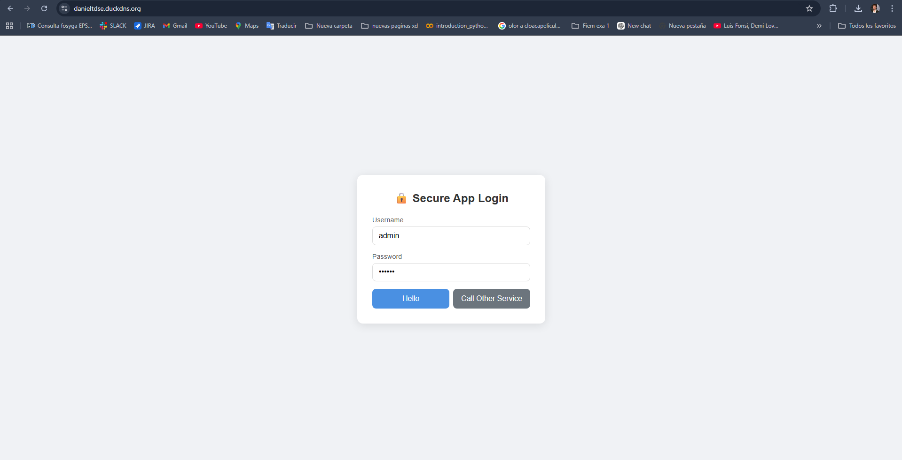
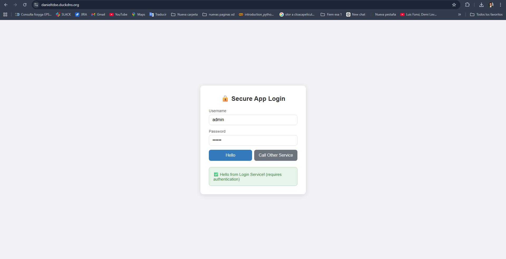
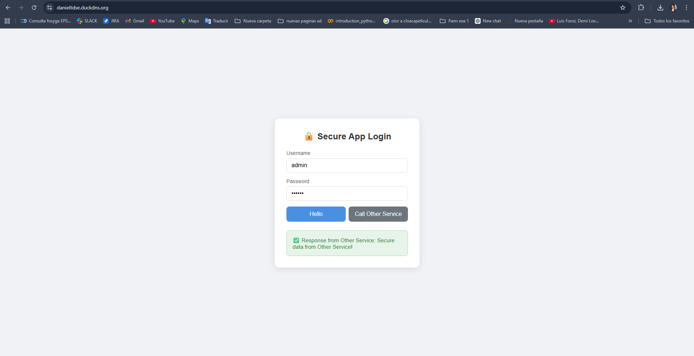
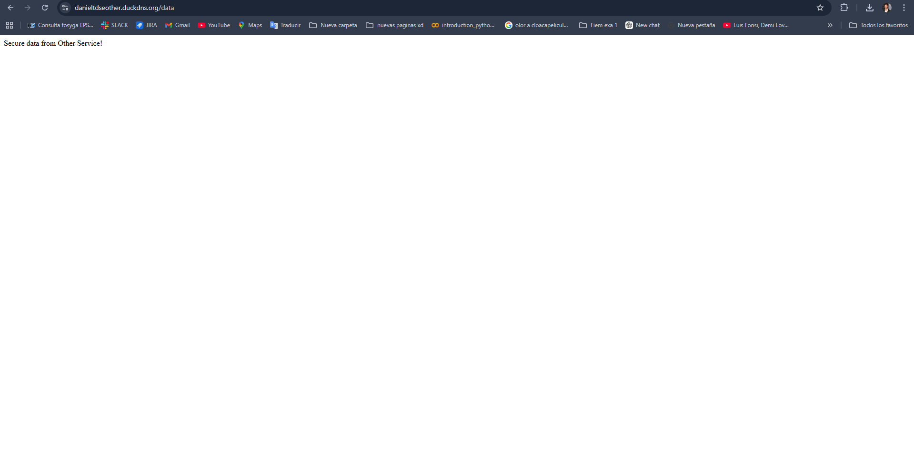
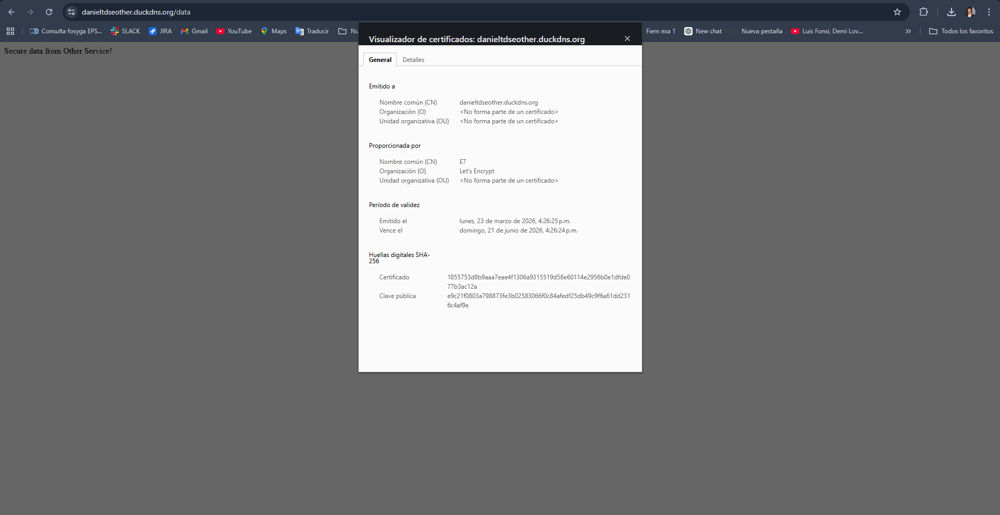
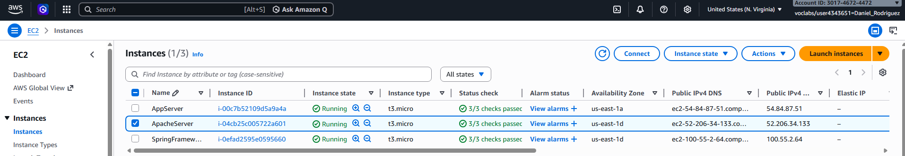
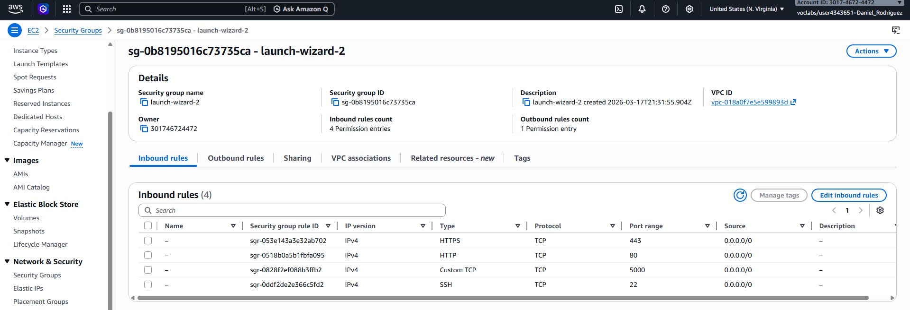
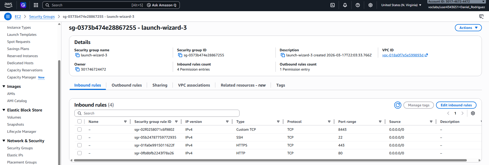
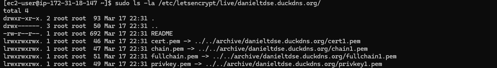
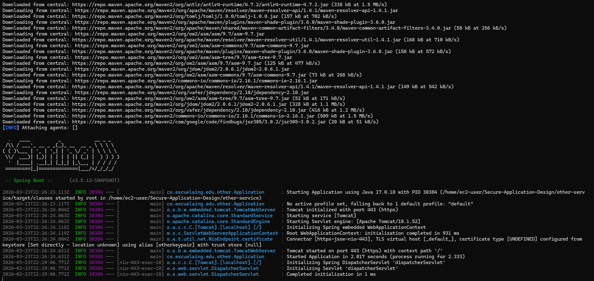

# Secure Application Design

**Author:** Daniel Rodriguez
**Course:** TDSE 2026-1
**Date:** March 2026

---

## Overview

This project implements a secure two-tier web application using **HTTPS**, **TLS certificates**, **Spring Boot**, and **AWS EC2**. It demonstrates secure communication between two independent backend services deployed on separate servers, featuring an asynchronous HTML/JavaScript client and BCrypt-hashed password storage, following the **12-Factor App** methodology.

### Key Security Features

-  End-to-end **HTTPS** with **Let's Encrypt** certificates on both servers
-  **BCrypt** password hashing (replaces deprecated plain-text encoder)
-  **HTTP Basic Authentication** on protected endpoints
-  **Mutual TLS** for inter-service communication (PKCS12 TrustStores)
-  **Async HTML/JS client** served directly from login-service
-  **Environment variable** based secret management (12-Factor App)
-  Both services deployed on **separate AWS EC2** instances

---

## Architecture

```
Browser (HTTPS)
       │
       ▼
┌──────────────────────────────────┐
│  EC2 - Apache Server             │
│  danieltdse.duckdns.org          │
│  login-service (Port 443)        │
│  Let's Encrypt Certificate     │
│  Spring Boot + Spring Security   │
│  BCrypt Password Hashing         │
│  Serves HTML/JS Async Client     │
└──────────────┬───────────────────┘
               │ HTTPS (Mutual TLS / PKCS12 TrustStore)
               ▼
┌──────────────────────────────────┐
│  EC2 - SpringFramework Server    │
│  danieltdseother.duckdns.org     │
│  other-service (Port 443)        │
│  Let's Encrypt Certificate    │
│  Spring Boot REST API            │
└──────────────────────────────────┘
```

### Infrastructure

| Instance | Type | OS | Service | Domain |
|----------|------|----|---------|--------|
| ApacheServer | t3.micro | Amazon Linux 2023 | login-service | danieltdse.duckdns.org |
| SpringFramework | t3.micro | Amazon Linux 2023 | other-service | danieltdseother.duckdns.org |

---

## Project Structure

```
Secure-Application-Design/
├── login-service/
│   ├── src/
│   │   └── main/
│   │       ├── java/co/escuelaing/edu/login/
│   │       │   ├── Application.java
│   │       │   ├── HelloController.java
│   │       │   ├── SecurityConfig.java          ← BCrypt config here
│   │       │   └── SecureServiceCaller.java
│   │       └── resources/
│   │           ├── application.properties
│   │           ├── static/
│   │           │   └── index.html               ← Async HTML/JS client
│   │           └── keystores/
│   │               ├── loginkeystore.p12         ← (not in repo, generated locally)
│   │               └── loginTrustStore.p12       ← (not in repo, generated locally)
│   └── pom.xml
│
├── other-service/
│   ├── src/
│   │   └── main/
│   │       ├── java/co/escuelaing/edu/other/
│   │       │   ├── Application.java
│   │       │   └── OtherController.java
│   │       └── resources/
│   │           ├── application.properties
│   │           └── keystores/
│   │               ├── otherkeystore.p12         ← (not in repo, generated locally)
│   │               └── otherTrustStore.p12       ← (not in repo, generated locally)
│   └── pom.xml
│
├── pom.xml                                       ← Multi-module Maven root
├── .gitignore
└── README.md
```

---

## Security Implementation

### BCrypt Password Hashing

User passwords are hashed with **BCryptPasswordEncoder** (cost factor 10). This replaces the deprecated `withDefaultPasswordEncoder()` that stored passwords in plain text.

```java
@Configuration
public class SecurityConfig {

    @Bean
    public PasswordEncoder passwordEncoder() {
        return new BCryptPasswordEncoder();
    }

    @Bean
    public SecurityFilterChain filterChain(HttpSecurity http) throws Exception {
        http
            .authorizeHttpRequests(auth -> auth
                .requestMatchers("/hello", "/call").authenticated()
                .anyRequest().permitAll()
            )
            .httpBasic(basic -> {});
        return http.build();
    }

    @Bean
    public UserDetailsService userDetailsService(PasswordEncoder encoder) {
        var user = User.builder()
            .username("admin")
            .password(encoder.encode("secret"))  // BCrypt hash — never plain text
            .roles("USER")
            .build();
        return new InMemoryUserDetailsManager(user);
    }
}
```

### Mutual TLS Between Services

The `login-service` communicates with `other-service` over HTTPS using a **PKCS12 TrustStore** containing the other service's certificate. This prevents MITM attacks on the internal inter-service channel.

| Store | Location | Contains |
|-------|----------|----------|
| `loginkeystore.p12` | login-service | login-service private key + Let's Encrypt cert |
| `loginTrustStore.p12` | login-service | other-service's certificate (trusted) |
| `otherkeystore.p12` | other-service | other-service private key + Let's Encrypt cert |
| `otherTrustStore.p12` | other-service | login-service's certificate (trusted) |

### Asynchronous HTML/JS Client

The frontend is a single-page HTML application served by `login-service`. It uses the native `fetch()` API with HTTP Basic Authentication to call protected endpoints asynchronously — no page reloads.

```javascript
async function callHello() {
    const credentials = btoa(username + ':' + password);
    const response = await fetch('/hello', {
        method: 'GET',
        headers: { 'Authorization': 'Basic ' + credentials }
    });
    // Display result inline without reloading the page
}
```

---

## API Endpoints

### login-service (`danieltdse.duckdns.org` / localhost:5000)

| Method | Endpoint | Auth Required | Description |
|--------|----------|---------------|-------------|
| GET | `/` | No | Service greeting |
| GET | `/hello` | Yes (Basic) | Protected hello message |
| GET | `/call` | Yes (Basic) | Calls other-service securely via TLS |

### other-service (`danieltdseother.duckdns.org` / localhost:6000)

| Method | Endpoint | Auth Required | Description |
|--------|----------|---------------|-------------|
| GET | `/data` | No | Returns secure data string |

Default credentials: `admin` / `secret`

---

## Prerequisites

- Java 17+
- Maven 3.8+
- AWS Account with two EC2 instances (t3.micro)
- DuckDNS domains pointing to each EC2 instance
- Port 22, 80, and 443 open in Security Groups

---

## Local Setup (Development & Testing)

### 1. Clone the repository

```bash
git clone https://github.com/DaniAleRoB/Secure-Application-Design.git
cd Secure-Application-Design
```

### 2. Create keystore directories

```bash
mkdir -p login-service/src/main/resources/keystores
mkdir -p other-service/src/main/resources/keystores
```

### 3. Generate key pairs and self-signed certificates

```bash
# Generate login-service keystore
keytool -genkeypair -alias loginkeypair -keyalg RSA -keysize 2048 \
  -storetype PKCS12 \
  -keystore login-service/src/main/resources/keystores/loginkeystore.p12 \
  -validity 3650

# Generate other-service keystore
keytool -genkeypair -alias otherkeypair -keyalg RSA -keysize 2048 \
  -storetype PKCS12 \
  -keystore other-service/src/main/resources/keystores/otherkeystore.p12 \
  -validity 3650
```

### 4. Export certificates

```bash
keytool -export \
  -keystore login-service/src/main/resources/keystores/loginkeystore.p12 \
  -alias loginkeypair -file logincert.cer

keytool -export \
  -keystore other-service/src/main/resources/keystores/otherkeystore.p12 \
  -alias otherkeypair -file othercert.cer
```

### 5. Create cross TrustStores

```bash
keytool -import -file othercert.cer -alias otherCA \
  -keystore login-service/src/main/resources/keystores/loginTrustStore.p12 \
  -storetype PKCS12

keytool -import -file logincert.cer -alias loginCA \
  -keystore other-service/src/main/resources/keystores/otherTrustStore.p12 \
  -storetype PKCS12
```

### 6. Run locally (two terminals)

> ⚠️ Start `other-service` first — `login-service` connects to it on startup.

**Terminal 1 — other-service:**
```bash
cd other-service
mvn spring-boot:run
```

**Terminal 2 — login-service:**
```bash
cd login-service
mvn spring-boot:run
```

### 7. Test locally

Open a browser and navigate to:

| URL | Description | Screenshot |
|-----|-------------|------------|
| `https://localhost:5000/` | Login service UI | See "Login Service Browser UI" below |
| `https://localhost:5000/hello` | Protected endpoint (use `admin:secret`) | See "Hello Endpoint Test" below |
| `https://localhost:5000/call` | Calls other-service securely | See "Call Other Service Test" below |
| `https://localhost:6000/data` | Other service data | See "Other Service Direct Endpoint" below |

#### Login Service Browser UI (HTTPS)



#### Hello Endpoint Test (Protected)




#### Call Other Service Test (Mutual TLS)



#### Other Service Direct Endpoint



#### TLS Certificate Validation


---

## AWS Deployment

### Prerequisites: EC2 Instances and Security Groups

Before deploying, verify your AWS infrastructure:

1. **Create two EC2 instances** (t3.micro, Amazon Linux 2023)
   - Instance 1: `ApacheServer` (for login-service)
   - Instance 2: `SpringFramework` (for other-service)

2. **Configure Security Groups** — Apply these inbound rules to both instances:

| Type | Port | Source | Purpose |
|------|------|--------|---------|
| SSH | 22 | Your IP only | Remote management |
| HTTP | 80 | 0.0.0.0/0 | Certbot HTTP-01 challenge |
| HTTPS | 443 | 0.0.0.0/0 | Application traffic |



> 📸 **Screenshot: Security Groups — Port Configuration**
> In **AWS Console → EC2 → Security Groups**, click on the security group attached to either instance, then go to the **Inbound rules** tab. Take a screenshot showing ports **22 (SSH)**, **80 (HTTP)**, and **443 (HTTPS)** open. Save as `img/aws-security-groups.png`.

**ApacheServer**



**SpringFramework**



### 1. Install dependencies on both EC2 instances

```bash
sudo dnf install java-17-amazon-corretto maven git -y
```

### 2. Clone the repository on each EC2

```bash
git clone https://github.com/DaniAleRoB/Secure-Application-Design.git
cd Secure-Application-Design
```

### 3. Copy keystores to each EC2 (from local machine)

**Apache EC2 (login-service):**
```bash
scp -i "ApacheServer.pem" login-service/src/main/resources/keystores/loginkeystore.p12 \
  ec2-user@<APACHE_IP>:~/Secure-Application-Design/login-service/src/main/resources/keystores/

scp -i "ApacheServer.pem" login-service/src/main/resources/keystores/loginTrustStore.p12 \
  ec2-user@<APACHE_IP>:~/Secure-Application-Design/login-service/src/main/resources/keystores/
```

**SpringFramework EC2 (other-service):**



### 4. Install Let's Encrypt on both EC2 instances

```bash
sudo dnf install python3-devel augeas-devel gcc -y
sudo python3 -m venv /opt/certbot/
sudo /opt/certbot/bin/pip install --upgrade pip
sudo /opt/certbot/bin/pip install certbot
sudo ln -s /opt/certbot/bin/certbot /usr/local/bin/certbot
```

**Apache EC2:**
```bash
sudo systemctl stop httpd
sudo certbot certonly --standalone -d danieltdse.duckdns.org
```

**SpringFramework EC2:**
```bash
sudo certbot certonly --standalone -d danieltdseother.duckdns.org
```

### 5. Convert Let's Encrypt certificates to PKCS12

**Apache EC2:**
```bash
sudo openssl pkcs12 -export \
  -in /etc/letsencrypt/live/danieltdse.duckdns.org/fullchain.pem \
  -inkey /etc/letsencrypt/live/danieltdse.duckdns.org/privkey.pem \
  -out ~/Secure-Application-Design/login-service/src/main/resources/keystores/loginkeystore.p12 \
  -name loginkeypair -passout pass:123456
```

**SpringFramework EC2:**
```bash
sudo openssl pkcs12 -export \
  -in /etc/letsencrypt/live/danieltdseother.duckdns.org/fullchain.pem \
  -inkey /etc/letsencrypt/live/danieltdseother.duckdns.org/privkey.pem \
  -out ~/Secure-Application-Design/other-service/src/main/resources/keystores/otherkeystore.p12 \
  -name otherkeypair -passout pass:123456
```

### 6. Run services on port 443

>  Start `other-service` first.

**SpringFramework EC2:**
```bash
cd ~/Secure-Application-Design/other-service
sudo PORT=443 nohup mvn spring-boot:run &
```



### 7. Test on AWS

Once both services are running, test them in a browser:

| URL | Description | Screenshot |
|-----|-------------|------------|
| `https://danieltdse.duckdns.org/` | Login UI (no auth required) | See "Login UI HTTPS" screenshot in Local Setup |
| `https://danieltdse.duckdns.org/hello` | Protected endpoint (use `admin:secret`) | See "Hello Endpoint Test" screenshot in Local Setup |
| `https://danieltdse.duckdns.org/call` | Calls other-service via mutual TLS | See "Call Other Service Test" screenshot in Local Setup |
| `https://danieltdseother.duckdns.org/data` | Other service data | See "Other Service Direct Endpoint" screenshot in Local Setup |

All endpoints should return `https://` with a valid Let's Encrypt certificate (green padlock in browser).

| URL | Description |
|-----|-------------|
| `https://danieltdse.duckdns.org/` | Login UI (no auth required) |
| `https://danieltdse.duckdns.org/hello` | Protected endpoint |
| `https://danieltdse.duckdns.org/call` | Calls other-service via mutual TLS |
| `https://danieltdseother.duckdns.org/data` | Other service data |

---

## Environment Variables (12-Factor App)

No secrets are hardcoded in source files. All sensitive values are passed via environment variables.

## ariable | Description | Default (Dev Only) |
|----------|-------------|---------------------|
| `PORT` | Server port | `5000` (login), `6000` (other) |
| `KEYSTORE_PASSWORD` | PKCS12 keystore password | `123456` |
| `TRUSTSTORE_PASSWORD` | TrustStore password | `123456` |
| `TRUSTSTORE_PATH` | TrustStore file path | classpath default |

>  All `.p12` and `.cer` files are excluded from the repository via `.gitignore`.

---

## Technologies

| Technology | Version | Purpose |
|------------|---------|---------|
| Java | 17 | Programming language |
| Spring Boot | 3.2 | Application framework |
| Spring Security | 6.x | Auth, BCrypt, HTTP Basic filter |
| BCryptPasswordEncoder | Built-in | Secure password hashing |
| Maven | 3.8+ | Build and dependency management |
| Keytool | JDK built-in | PKCS12 keystore generation |
| Let's Encrypt / Certbot | Latest | Publicly trusted TLS certificates |
| OpenSSL | System | PEM to PKCS12 conversion |
| AWS EC2 | t3.micro | Cloud compute instances |
| Amazon Linux | 2023 | Server operating system |
| DuckDNS | Free DDNS | Dynamic DNS for public IPs |
| HTML5 + fetch() | Native browser | Async single-page client |

---

## Notes

- `.p12` and `.cer` files are excluded from the repository via `.gitignore`. Generate them locally following the setup instructions.
- `other-service` must be started **before** `login-service`.
- When restarting EC2 instances, update DuckDNS with the new public IP.
- Let's Encrypt certificates expire after **90 days**. Set up auto-renewal with:

```bash
echo "0 0,12 * * * root /opt/certbot/bin/python -c 'import random; import time; time.sleep(random.random() * 3600)' && sudo certbot renew -q" | sudo tee -a /etc/crontab > /dev/null
```